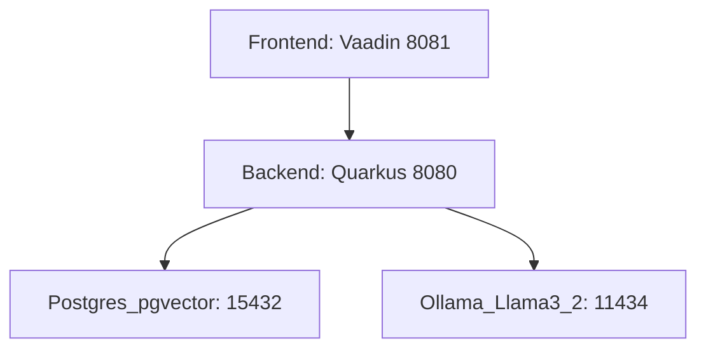
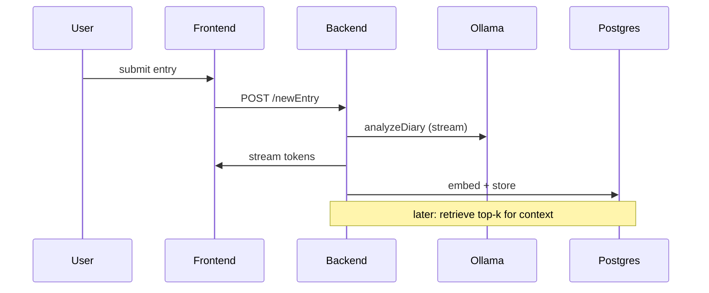

# AI Diary: Practical Walkthrough (≈20min)
## YouTube Video Script — Readable, human, senior-engineer tone

---

## PART 1 — INTRO (≈2:00)

Voice: calm, conversational, a little wry. This is you talking to peers—no hype, no marketing. Slow pace. Pause after each paragraph.

Opening lines (natural):

"Hey—I recently got back into Stoicism and started journaling again. Not grand Meditations-level, just everyday notes where I try to catch myself: the thoughts, the reactions, the dumb things I did.

That led me to this project: an AI-first journal that runs locally, stores semantic memory as vectors and helps you spot patterns in your own life. Today I'll show you how it works end-to-end: the containers, the backend, the vector magic, and a running demo. No hand-wavy buzzwords—just code, diagrams, and a little philosophy for seasoning.

What I want you to walk away with: how to build a private, scalable, pragmatic AI diary—one you can run on your laptop or server.

Quick rundown of tech we’ll use (say fast, then pause): Java 21 + Quarkus, Vaadin on the front, PostgreSQL + pgvector, Ollama running Llama 3.2 locally, and LangChain4j wiring it together. Alright—let's get practical."

---

## PART 2 — SYSTEM ARCHITECTURE (≈3:00)

Say this while showing `docker-compose.yml` behind you. Point to lines as you mention ports and services.

Short summary: four containers, each a single responsibility.

Mermaid: high-level service diagram



Describe the compose file (speak to these bullets, keep it concrete):
- Ollama: serves the LLM on port 11434. We run it locally for privacy and latency. If you have a GPU, we attach it; otherwise CPU mode works (slower).
- PostgreSQL + pgvector: stores entries and vectors. We use a `vector(1024)` column and HNSW indexes for nearest-neighbor search.
- Quarkus backend: REST API, LangChain4j integrations, and the ingestion pipeline.
- Vaadin frontend: pure Java UI; streams AI responses to the user.

Tip for live demo: point to the compose env variables—`OLLAMA_KEEP_ALIVE=-1` (keep model warm), and the DB port mapping. That’s it for infra. Now to the meat: vectors.

---

## PART 3 — VECTORS & RAG (≈10:00)

This is the core. Slow, clear, with small jokes: e.g., "Vectors are boring arrays that get you powerful results—think of them as the spreadsheet for meaning."

Start simple: what is an embedding?

"When you write a sentence, the embedding model turns it into a float array — here 1024 floats. That's your idea, in numbers. Similar ideas = similar vectors. That's it."

Small concrete example (readable):

Text: "I’m nervous about tomorrow" → Embedding: [-0.01, 0.34, -0.9, ...] (1024 floats).

Explain similarity: cosine similarity. Keep it short:
- Cosine measures angle between vectors. 1 = same direction, 0 = orthogonal, -1 = opposite.

Database storage (explicit): show snippet and explain aloud.

```sql
ALTER TABLE documents ADD COLUMN embedding vector(1024);
CREATE INDEX ON documents USING hnsw (embedding vector_cosine_ops);
```

Speak to HNSW and performance (short):
- HNSW organizes vectors into a graph for fast nearest-neighbor search—practically logarithmic lookups for big datasets.

RAG pattern (Retrieval-Augmented Generation): explain step-by-step in plain language:

1) New entry arrives.
2) We ask the LLM for an analysis (mood, key scenario, short advice). It streams back a response.
3) Simultaneously we embed the text and store the embedding in PostgreSQL.
4) Next time, before generating a response, the backend retrieves top-N similar chunks and provides them as context to the LLM.

Mermaid: RAG flow



Language bindings: LangChain4j and Quarkus

Explain how LangChain4j simplifies wiring in Java:
- `@RegisterAiService` creates an LLM client bound to Ollama using Quarkus config.
- `Multi<String>` from Mutiny streams tokens to the client.

Show the `RagAssistant` interface briefly (read aloud, then point to it on screen):

```java
@RegisterAiService
@ApplicationScoped
public interface RagAssistant {
    @SystemMessage("""
      You are an empathetic coach. Provide: Mood, Key Scenario, Insight, Actionable Advice.
    """)
    Multi<String> analyzeDiary(@UserMessage String todaysEntry);
}
```

Explain streaming: front receives tokens while LLM is still composing. That’s better UX than waiting a long time.

Document splitting and chunking (important, slow):
- We use a recursive splitter with 500-token chunks. Long entries become multiple vectors so later retrieval can match exact paragraphs.
- Example: 2000-token entry → 4 chunks; each chunk gets its own embedding + metadata.

Explain the ingestion flow (concise):
- Persist raw entry
- Build an EmbeddingStoreIngestor with pgvector store and embedding model
- Ingest Document.from(text, metadata)

Show and read the key bits of `RagIngestService` code slowly (point to on screen):

```java
public void embedAndStoreNewEntry(DiaryEntryEntity newEntity) {
    repository.persist(newEntity);
    EmbeddingStoreIngestor ingestor = EmbeddingStoreIngestor.builder()
        .embeddingStore(embeddingStore)
        .embeddingModel(embeddingModel)
        .documentSplitter(recursive(500,0))
        .build();
    ingestor.ingest(Document.from(newEntity.entryText, Metadata.from(...)));
}
```

Wrap up this section by summarizing RAG value:
- You get context without fine-tuning. The model uses your past entries as memory. It’s private, incrementally growing, and interpretable.

---

## PART 4 — WORKFLOW & RUNNING EXAMPLE (≈4:00)

This is the live-demo script you’ll read while you run the app. Keep it natural—pause before showing the UI.

Pre-demo: show terminal with `docker compose up --build` running (explain stages briefly):

Say aloud while pointing at the compose output:
- Postgres initializes and loads pgvector
- Ollama starts and loads the model (takes time if large model)
- Backend starts and registers the LLM service
- Frontend starts on 8081

Now the user interaction (walkthrough):

1. Open `localhost:8081`. Show the input box.
2. Type: "Had a tense convo with my manager, felt defensive."
3. Hit submit.

While the UI streams back tokens, narrate: "See how the response appears? That's Mutiny streaming `Multi<String>` in action. The backend is generating analysis and at the same time preparing the embedding for storage."

After response completes, show the DB entry (psql snippet) and point to the `embedding` column (explain it’s a vector, not human-readable):

```sql
SELECT id, substring(entry_text,1,80) AS preview, ai_content FROM documents ORDER BY id DESC LIMIT 5;
```

Then show a second example—submit: "I feel anxious about the review tomorrow"—and point out how the backend pulls similar past chunks and references them in the LLM prompt.

For devs: show the `RagResource` orchestration method (read slowly):

```java
@POST @Path("/newEntry")
public Multi<String> addNewEntry(NewEntry newEntry) {
    RagAssistant assistant = provider.createAssistant();
    Multi<String> aiResponse = assistant.analyzeDiary(...);
    StringBuilder completeResult = new StringBuilder();
    aiResponse.onItem().invoke(completeResult::append);
    aiResponse.onCompletion().invoke(() -> ingestor.embedAndStoreNewEntry(...));
    return aiResponse;
}
```

Notes while demoing:
- The streaming response feels like a conversation
- The DB write is asynchronous and doesn't block the UI
- Retrieval uses `ORDER BY embedding <=> query LIMIT k` or LangChain4j helpers

---

## PART 5 — CLOSING + HANDY DETAILS (≈1:00)

Finish with a quick checklist and a small stoic line for mood:

Checklist to ship this yourself:
- Docker + Compose
- ~8GB RAM (model dependent)
- GPU optional
- Clone repo, `docker compose up --build`, open `localhost:8081`

Small stoic sign-off (casual):
"Technology won't make you virtuous—journaling might. This tool just helps you see your patterns faster. Ship it, try it, and maybe be a little less embarrassed by your past self."

---

## TECHNICAL REFERENCE (append as quick appendix behind the main script)

- API endpoints: `POST /newEntry`, `GET /entries`
- DB schema: `documents(id, entry_text TEXT, timestamp TIMESTAMP, ai_content TEXT, embedding vector(1024))`
- Key config:

```properties
quarkus.datasource.jdbc.url=jdbc:postgresql://db:15432/ai-diary
quarkus.langchain4j.ollama.base-url=http://ollama:11434
```

---

## TIMINGS & DELIVERY NOTES

- Total spoken: ~20 minutes
- Read slowly. Use pauses for diagrams and code highlights.
- Use the demo as the momentum: code => UI => DB => back to explanation.

Good. I saved the file so you can read it on-camera with the app running in the greenscreen background. If you want, I can trim it further, or produce a short teleprompter-friendly version with only lines to read and cues for actions.

---

## PART 2: SYSTEM ARCHITECTURE (3 minutes)

### Docker Compose Overview

*[Visual: Show docker-compose.yml file]*

"Our system has four containerized services. Let's start with the compose file:

```yaml
services:
  ollama:
    image: ollama/ollama:latest
    ports: ["11434:11434"]
    environment:
      - OLLAMA_KEEP_ALIVE=-1
    deploy:
      resources:
        devices:
          - driver: nvidia
            count: 1
            capabilities: [gpu]
  
  db:
    image: postgres + pgvector extension
    ports: ["15432:5432"]
    environment:
      - POSTGRES_DB=ai-diary
      
  backend:
    image: quarkus-app
    ports: ["8080:8080"]
    depends_on: [ollama, db]
    environment:
      - QUARKUS_DATASOURCE_JDBC_URL=jdbc:postgresql://db:15432/ai-diary
      - OLLAMA_HOST=http://ollama:11434
  
  frontend:
    image: spring-boot-vaadin
    ports: ["8081:8081"]
    environment:
      - BACKEND_URL=http://backend:8080
```

**Architecture:**
- **Ollama** (Port 11434): Runs Llama 3.2 locally with GPU acceleration. `OLLAMA_KEEP_ALIVE=-1` means the model stays loaded in memory.
- **PostgreSQL + pgvector** (Port 15432): Stores diary entries and their embeddings as 1024-dimensional vectors.
- **Quarkus Backend** (Port 8080): Handles REST endpoints, AI service orchestration, and vector ingestion.
- **Vaadin Frontend** (Port 8081): Pure Java web UI, handles user input and displays streaming responses."

---

## PART 3: THE TECHNICAL DEEP DIVE—VECTORS & RAG (14 minutes)

### Understanding Vector Embeddings

"When you submit a diary entry, the embedding model (part of Llama 3.2) converts text into a 1024-dimensional vector. Here's what that means practically:

Text: 'I felt defeated today. Nothing went right.'
↓
Vector: [-0.023, 0.456, -0.891, ..., 0.234] (1024 floats)

Each dimension captures semantic meaning. Similar texts produce nearby vectors in this high-dimensional space.

```
Text similarity by vector distance:
'I felt sad today' → Vector A
'I was depressed' → Very close to Vector A (small cosine distance)
'I felt incredibly happy' → Far from Vector A (large cosine distance)
```

**Why this matters:**
- You don't hardcode similarities. The model learns semantic relationships.
- Cosine similarity is fast to compute (dot product normalized).
- HNSW indexing in PostgreSQL makes even million-vector searches sub-millisecond.
- When you write 'I'm anxious,' the system instantly finds all similar past entries."

### Vector Storage in PostgreSQL with pgvector

"PostgreSQL has a `vector` type (via the pgvector extension):

```sql
ALTER TABLE documents ADD COLUMN embedding vector(1024);
CREATE INDEX ON documents USING hnsw (embedding vector_cosine_ops);
```

The HNSW (Hierarchical Navigable Small World) index is a graph structure that organizes vectors spatially. Searching is logarithmic instead of linear.

**Performance:**
- Linear scan: O(n) — slow for millions of entries
- HNSW index: O(log n) — blazing fast
- Exact distance: 0.0-2.0 for cosine similarity"

### Data Flow: From Input to Storage

### The Complete Request Flow

"Here's what happens end-to-end when you submit an entry:

```
1. Frontend: POST /newEntry
   {
     "entryText": "Today I felt anxious",
     "entryTimestamp": "2025-11-20T10:30:00"
   }

2. RagResource receives request
   ↓
3. Create RagAssistant (Quarkus injected proxy)
   ↓
4. Call analyzeDiary() → Streams Multi<String> to frontend
   ↓
5. While streaming, collect complete response
   ↓
6. On completion, trigger RagIngestService.embedAndStoreNewEntry()
   ↓
7. Store in PostgreSQL with embedding vector
```

This is non-blocking and reactive. The user sees responses immediately while background work completes."

### The Backend: RagResource

"The entry point is RagResource.java:

```java
@POST
@Path(\"/newEntry\")
public Multi<String> addNewEntry(NewEntry newEntry) {
    RagAssistant assistant = provider.createAssistant();
    
    // Step 1: Get streamed response from LLM
    Multi<String> aiResponse = assistant.analyzeDiary(
        \"Diary entry on %s:\\n%s\".formatted(
            newEntry.entryTimestamp(),
            newEntry.entryText()
        )
    );
    
    // Step 2: Collect chunks while streaming
    final StringBuilder completeResult = new StringBuilder();
    aiResponse.onItem().invoke(completeResult::append);
    
    // Step 3: On completion, embed and persist
    aiResponse.onCompletion().invoke(
        () -> ingestor.embedAndStoreNewEntry(
            new DiaryEntryEntity(
                newEntry.entryText(),
                newEntry.entryTimestamp(),
                completeResult.toString()
            )
        )
    );
    
    return aiResponse;  // Stream to client immediately
}
```

**Key points:**
- `Multi<String>`: Mutiny reactive stream. Each chunk is a separate item.
- `onItem()`: Called for each streamed token
- `onCompletion()`: Called after AI finishes, triggers async persistence
- Non-blocking: Frontend receives chunks instantly while database write happens in background"

### The RagAssistant Interface

"This is where LangChain4j handles the plumbing:

```java
@RegisterAiService
@ApplicationScoped
public interface RagAssistant {
    @SystemMessage(\"\"\"
        You are an empathetic and insightful personal growth coach.
        The user keeps a daily diary. Analyze today's entry in context 
        of all previous entries.
        
        Return:
        1. Mood: Identify emotional tone
        2. Key Scenario: Summarize the situation
        3. Growth Insight: Reflection based on patterns
        4. Actionable Advice: One suggestion for tomorrow
        
        Keep response under 200 words.
    \"\"\")
    Multi<String> analyzeDiary(@UserMessage String todaysEntry);
}
```

**What @RegisterAiService does:**
- Quarkus generates a proxy at runtime
- Automatically connects to Ollama (via environment config)
- Handles prompt management
- Manages the context window
- Streams responses via Multi<String>"

### The Embedding & Ingestion Service

"This is where vectors get created and stored:

```java
@ApplicationScoped
public class RagIngestService {
    
    @Inject EmbeddingModel embeddingModel;
    @Inject PgVectorEmbeddingStore embeddingStore;
    @Inject DiaryEntryRepository repository;
    
    @Transactional
    public void embedAndStoreNewEntry(DiaryEntryEntity newEntity) {
        // 1. Persist the diary entry
        repository.persist(newEntity);
        
        // 2. Setup the embedding ingestor
        EmbeddingStoreIngestor ingestor = EmbeddingStoreIngestor.builder()
            .embeddingStore(embeddingStore)
            .embeddingModel(embeddingModel)
            .documentSplitter(recursive(500, 0))
            .build();
        
        // 3. Ingest into vector store with metadata
        ingestor.ingest(
            Document.from(newEntity.entryText,
                Metadata.from(Map.of(
                    \"Timestamp\", DateTimeFormatter.ISO_DATE_TIME.format(newEntity.timestamp),
                    \"AI hint\", newEntity.aiContent
                )))
        );
    }
}
```

**Breaking it down:**

1. **Persistence**: Save raw entry to PostgreSQL
2. **Document Splitting**: Recursive split at 500 tokens with 0 overlap
   - Why? Long entries contain multiple semantic topics
   - Splitting lets us find relevant *paragraphs*, not just whole entries
   - Example: A long entry about work AND relationships gets split into 2-3 chunks
3. **Embedding**: Each chunk → 1024-dimensional vector
4. **Storage**: Vector + metadata stored in pgvector
   - Metadata includes timestamp and AI analysis for later retrieval"

### Document Splitting Strategy

"The `recursive(500, 0)` splitter is critical:

```
Original diary entry: 2000 tokens

↓ Split at 500-token boundaries

Chunk 1 (tokens 1-500) → Embedding 1
Chunk 2 (tokens 500-1000) → Embedding 2
Chunk 3 (tokens 1000-1500) → Embedding 3
Chunk 4 (tokens 1500-2000) → Embedding 4

All stored in pgvector with their metadata
```

Later, when the user writes something new, the system can find specific relevant paragraphs from weeks ago. This is RAG (Retrieval Augmented Generation)."

### The Entity Model

```java
@Entity
@Table(name = \"documents\")
public class DiaryEntryEntity extends PanacheEntity {
    
    @Column(columnDefinition = \"TEXT\")
    public String entryText;
    
    public LocalDateTime timestamp;
    
    @Column(columnDefinition = \"TEXT\")
    public String aiContent;
    
    @Column(columnDefinition = \"vector(1024)\")
    public float[] embedding;
}
```

The `vector(1024)` column:
- Not a string or JSON
- Native PostgreSQL type optimized for similarity queries
- Indexed with HNSW for fast nearest-neighbor searches
- Cosine distance: measures angle between vectors (0 = identical, 2 = opposite)"

### RAG in Action

"When a new entry comes in, LangChain4j automatically:

1. Embeds the new entry
2. Queries PostgreSQL for similar vectors
3. Passes top results as context to the LLM

```
New entry: \"I'm nervous about tomorrow's presentation\"

↓ Embed to vector

↓ Query PostgreSQL:
   SELECT * FROM documents 
   ORDER BY embedding <=> query_vector 
   LIMIT 5

↓ Get back 5 most similar past entries

↓ LLM sees them in context, can say:
   \"I notice you've been anxious about presentations before.
    Two months ago you said...[similar entry]...
    You handled it well then.\"
```

This is continuous learning without fine-tuning. The LLM has full history available."

## PART 4: FRONTEND & DEPLOYMENT (3 minutes)

### Vaadin Frontend

"Frontend is Spring Boot + Vaadin. Key points:

1. **100% Java** — No JavaScript frameworks needed
2. **Component-based** — Buttons, text areas, grids are objects
3. **Two-way binding** — Changes sync automatically
4. **Reactive backend** — Streams responses from backend

User flow:
- Text area for diary input
- POST to `/newEntry` on submit
- Receive `Multi<String>` response
- Display tokens as they arrive
- Button to view previous entries"

### Deployment with Docker

"Everything runs in containers:

```bash
docker-compose up --build
```

Services start in order:
1. PostgreSQL initializes pgvector extension
2. Ollama pulls and runs Llama 3.2
3. Backend connects to both
4. Frontend connects to backend
5. System ready in ~30 seconds (cold start)

**Performance:**
- Quarkus JVM mode: ~1 second startup
- Quarkus native: ~50ms startup
- Backend memory: ~300MB
- Complete diary analysis: 15-30 seconds (LLM inference time)"

## PART 5: CLOSING & NEXT STEPS (2 minutes)

### Getting Started

"To run this yourself:

```bash
git clone <repo>
cd ai-diary
docker-compose up --build
```

Then navigate to `localhost:8081` and start writing.

**Requirements:**
- Docker + Docker Compose
- ~8GB RAM (4GB for Ollama, 2GB for app, 2GB buffer)
- GPU recommended but not required (CPU mode works, slower)
- ~5GB disk space (for Llama 3.2 model)"

### Key Takeaways

"What we built:
1. **End-to-end AI system** — Fully local, no external API calls
2. **Vector-based memory** — Semantic similarity without hardcoding
3. **Reactive streaming** — Real-time UI feedback
4. **Production-ready** — Uses battle-tested frameworks
5. **Scalable** — Architecture supports millions of entries

Technical highlights:
- Quarkus + LangChain4j for AI integration
- PostgreSQL pgvector for semantic search
- Ollama for local LLM inference
- Vaadin for pure Java frontend
- Docker for reproducible deployment"

---

## PART 8: TECHNICAL REFERENCE (2 minutes)

### Stack Summary

```
┌────────────────────────────────────┐
│      COMPLETE TECH STACK           │
├────────────────────────────────────┤
│ Language: Java 21                  │
│ Backend: Quarkus 3.28.5            │
│ Frontend: Spring Boot 3.5.6 + Vaadin
│ Database: PostgreSQL + pgvector    │
│ LLM Framework: LangChain4j         │
│ LLM Runtime: Ollama + Llama 3.2   │
│ Build: Maven                       │
│ Deployment: Docker + Docker Compose│
└────────────────────────────────────┘
```

### Key Dependencies

Backend:
- `io.quarkus:quarkus-rest` — REST endpoints
- `io.quarkus:quarkus-hibernate-orm-panache` — ORM
- `io.quarkiverse.langchain4j:quarkus-langchain4j-ollama` — LLM integration
- `io.quarkiverse.langchain4j:quarkus-langchain4j-pgvector` — Vector store
- `io.quarkus:quarkus-mutiny` — Reactive streams

Frontend:
- `com.vaadin:vaadin-spring-boot-starter` — UI components
- `org.springframework:spring-webflux` — Reactive web

### Database Schema

```sql
CREATE TABLE documents (
    id BIGSERIAL PRIMARY KEY,
    entry_text TEXT,
    timestamp TIMESTAMP,
    ai_content TEXT,
    embedding vector(1024)
);

CREATE INDEX ON documents 
USING hnsw (embedding vector_cosine_ops);
```

The HNSW index is created automatically by LangChain4j."

### Configuration

```properties
# Quarkus config
quarkus.datasource.jdbc.url=jdbc:postgresql://db:15432/ai-diary
quarkus.datasource.username=ai-diary
quarkus.langchain4j.ollama.base-url=http://ollama:11434
```

### API Endpoints

```
POST /newEntry
  Content-Type: application/json
  Body: {
    "entryText": "string",
    "entryTimestamp": "2025-11-20T10:30:00"
  }
  Response: Server-Sent Events (text/plain, streaming)

GET /entries?amount=10&offset=0
  Response: List<ProcessedEntry> (JSON)
```

## END SCRIPT

**Total Length: ~20 minutes**

### Timing Breakdown
- Introduction: 1.5 min
- Architecture: 3 min
- Technical Deep Dive: 14 min
- Frontend & Deployment: 3 min
- Closing: 2 min
- Technical Reference: 2 min

---

## VISUAL AIDS NEEDED

1. Docker Compose architecture diagram
2. Vector embedding visualization (1024-dimensional space)
3. Data flow: input → embedding → storage → retrieval
4. HNSW index structure
5. Code walkthrough with syntax highlighting
6. Performance metrics comparison
7. Database schema diagram

---

## SPEAKER NOTES & TIPS

### Pacing

- **Architecture section**: Slow down here. Many viewers won't know Docker/containers.
- **Vector section**: This is the "magic" moment. Emphasize why cosine distance matters.
- **RAG section**: Show concrete example (anxious entry finds previous similar entries).
- **Code snippets**: Read them aloud, explain each annotation.

### Live Demo (Optional)

If recording live:
1. Show `docker-compose up` starting
2. Show frontend at `localhost:8081`
3. Write a test entry
4. Show AI response streaming
5. Check PostgreSQL with `psql` to show embedded vectors

### Key Concepts to Hammer Home

1. **Embeddings are not magic** — They're just vectors, math we understand
2. **pgvector is a game-changer** — Vector search in your database, no external service
3. **RAG means never losing context** — Old entries inform new analysis
4. **Streaming matters** — UX and psychological impact of seeing responses unfold
5. **Local-first is powerful** — Privacy + control + speed

### Common Questions

**Q: Why Ollama instead of OpenAI?**
- Privacy, cost, control, speed, local processing

**Q: Why Quarkus vs Spring Boot?**
- Startup time, memory footprint, cloud-native design

**Q: Can this scale to millions of entries?**
- Yes. HNSW indexing is logarithmic. pgvector can handle billions.

**Q: How long are typical AI responses?**
- 15-30 seconds (Llama 3.2 inference, not framework overhead)

**Q: Can I use a different LLM?**
- Yes. Ollama supports many models. Change one config line.

---

## OPTIONAL EXTENSIONS

### Future improvements to mention:
- Multi-user diaries (shared reflection spaces)
- Wearable integration (mood + heart rate correlation)
- Export/visualization of emotional trends
- Multi-language support
- Fine-tuning on personal style
- Graph database for connection analysis
- Mobile app with offline-first sync
